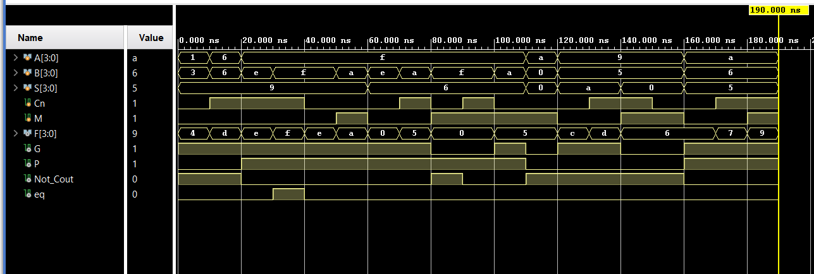

# 74LS181 ALU using Generate-Propagate Logic

## Quick Links  
- [Output Waveform](#output-waveform)  
- [References](#references)

## Overview  
This project implements a **74LS181 ALU** in Verilog. The design includes logic equations to compute the ALU output, carry outputs, and equality flag.

## Directory Structure  
- **`src/`**  
    - `GeneratePropagateUnit.v` — Module for internal carry generate and carry propagate signals  
    - `alu_74ls181.v` — 74LS181 ALU module implementing arithmetic/logic operations  
- **`tb/`**  
    - `tb.v` — Testbench for verifying ALU functionality  
- **`sim/`**
    - `sim.png` — Output Waveform
- **`README.md`** — Contains **Refrences** and Documentation

## Design Explanation  
The ALU design uses the **GeneratePropagateUnit** to derive intermediate carry signals. Key features include:
- **Selector-Based Logic:** Uses a 4-bit selector (`S`) to influence the carry generate and propagate computations.
- **Complex Output Calculation:** The ALU computes a 4-bit function (`F`) based on the generated signals, with additional outputs for generate carry (`G`), propagate carry (`P`), and the inverted final carry (`Not_Cout`).
- **Equality Check:** An equality flag (`A_eq_B`) is generated by evaluating the ALU function output.

## Modules  
- **GeneratePropagateUnit:**  
  Computes carry generate (`G`) and propagate (`P`) signals from single-bit inputs using a set of combinational equations.
  
- **ALU 74LS181:**  
  Integrates four instances of the GeneratePropagateUnit to form a 4-bit ALU. It processes two 4-bit operands (`A` and `B`) along with a 4-bit selector and an inverted carry input, generating the ALU output and additional status signals.

## Simulation  
Run the testbench in **Vivado ModelSim/ISE** or any compatible Verilog simulator. The expected waveform should demonstrate correct ALU operation with proper carry, propagate, and equality outputs.

Example waveform output:  
  

## How to Run  
1. Create a new project in your preferred Verilog development environment.
2. Add the files from the `src/` folder as design sources.
3. Include the testbench file from the `tb/` folder as the simulation source.
4. Simulate and check the waveform for correct ALU behavior.

## Tools Used  
- **Vivado/ModelSim/ISE** for simulation  
- **Verilog HDL** for design  

## References  
- [74LS181 ALU Overview and Diagram](https://susta.cz/fel/74/pdf/sn_74181.pdf)  
- [Generate and Propagate Concepts](https://www.righto.com/2017/03/inside-vintage-74181-alu-chip-how-it.html)  
- 

## License  
This project is open-source. Feel free to use, modify, and distribute it as needed.

---  
Happy Coding! 🚀
